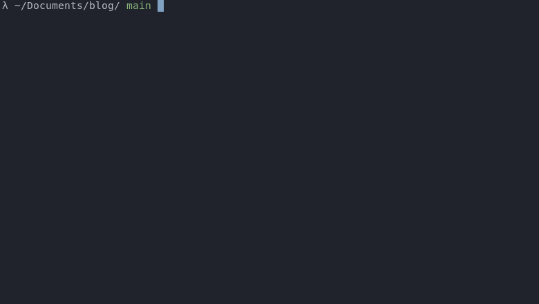

[](https://github.com/Kaderovski)
[](https://github.com/tterb/atomic-design-ui/blob/master/LICENSEs)
<p align="center">
    
</p>
<h1 align="center">Pulldozer</h1>
<p align="center"><i>Pulldozer is a simple, light, fast and modular continous delivery tool 100% UNIX compliant</i></p>

## Table of contents

- [Preview](#preview)
- [Installation](#installation)
  - [Requirements](#requirements)
  - [Install Pulldozer](#install-pulldozer)
- [Usage](#usage)
  - [Options](#options)
- [Configuration File](#configuration-file)
- [License](#license)

# Preview
<p align="center">
    
</p>

# Installation
In order to work with `Pulldozer` you need at least three dependencies to be installed and reachable through you `$PATH`.

## Requirements
Please install the following :
- jq
- curl
- git

## Install Pulldozer
You can follow the following commands :
```
git clone https://github.com/Kaderovski/pulldozer.git && \
chmod +x pulldozer/pulldozer.sh && \
cd pulldozer && \
sudo ln -s $(pwd)/pulldozer.sh /usr/local/bin/pulldozer && \
pulldozer --help
```

Should return :
```
Usage: pulldozer [-h --help] [-d --daemon] [-D --dry-run] [-s --silent] [-x --debug]

Script description here.

Available options:

-h, --help            Print this help and exit
-b, --branch          On which branch pull
-c, --config-file     Where pulldozer.json is located, default in ./pulldozer.json
-d, --daemon-fmt      Will clean output for daemon journalctl
-D, --dry-run         Dry-run
-m, --mention-slack   Mention a user on slack webhook, expected user_id
-r, --rule            Which post hook rule should be exec 
-s, --silent          Hide output
-S, --slack-webhook   Webhook URL to post on channel
-x, --debug           Enter in debug view
```

# Usage
There are few arguments you can use to run your continous integration, most of them can be defined in your configuration file `pulldozer.json` (see pulldozer.json.example file).

## Options

#### Display help

```shell
# e.g
pulldozer -h
```

| Parameter | Type     | Description                |
| :-------- | :------- | :------------------------- |
| `-h --help` | `none` | Optional. Show help usage |

#### Define production branch

```shell
# e.g
pulldozer -b my-branch 
```

| Parameter | Type     | Description                |
| :-------- | :------- | :------------------------- |
| `-b --branch` | `string` | Optional. Chose your production branch to pull|

#### Config file location

```shell
# e.g
pulldozer -c /path/to/pulldozer.json 
```

| Parameter | Type     | Description                |
| :-------- | :------- | :------------------------- |
| `-c --config-file` | `string` | Optional. Where you configuration file is located|

#### Daemon stdout

```shell
# e.g
pulldozer -d
```

| Parameter | Type     | Description                |
| :-------- | :------- | :------------------------- |
| `-d --daemon` | `none` | Optional. Remove dynamic stdout in order to match daemon journal|

#### Dry Run

```shell
# e.g
pulldozer -D
```

| Parameter | Type     | Description                |
| :-------- | :------- | :------------------------- |
| `-D --dry-run` | `none` | Optional. Only check if pull is needed and return file diff without any write|

#### Slack mention

```shell
# e.g
pulldozer -m UA1B2C3D4
```

| Parameter | Type     | Description                |
| :-------- | :------- | :------------------------- |
| `-m --mention-slack` | `string` | Optional. Add a ping to @user when on your slack webhook payload message|

#### Rule

```shell
# e.g
pulldozer -r django
```

| Parameter | Type     | Description                |
| :-------- | :------- | :------------------------- |
| `-r --rule` | `string` | Optional. Chose a custom logic rule to apply after git pulling located in rules folder| 

#### Silent

```shell
# e.g
pulldozer -s
```

| parameter | type     | description                |
| :-------- | :------- | :------------------------- |
| `-s --silent` | `none` | optional. mute stdout| 

#### Slack webhook 

```shell
# e.g
pulldozer -S https://hooks.slack.com/services/xxxx/xxxx/xxxxxxx
```

| Parameter | Type     | Description                |
| :-------- | :------- | :------------------------- |
| `-S --slack-webhook` | `string` | Optional. Slack webhook URL| 

#### Debug

```shell
# e.g
pulldozer -x
```

| Parameter | Type     | Description                |
| :-------- | :------- | :------------------------- |
| `-x --debug` | `string` | Optional. Start script with bash -x option| 


# Configuration File

You can specify default options stored in `.pulldozer.json` located on your project root directory.

Here is default template :
```json
{
  "prod_branch" : "main", 
  "rule": "django",
  "slack": [
    {
      "webhook": "https://hooks.slack.com/services/xxxx/xxx/xxxx",
      "mention": "U1AB2C3D4"
    }
  ]
}
```

# License

[MIT](https://choosealicense.com/licenses/mit/)
